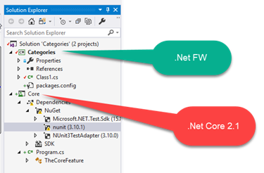

This issue was reported [here](https://developercommunity.visualstudio.com/content/problem/319486/intellisense-of-nuget-packages-is-broken.html), and has been fixed in Visual Studio version 15.8.6 per Oct 2nd 2018.  

It now looks like:

#### Showing the issue
I notice that VS is still (15.8.5) showing yellow markers where there is no need for them to be.

The .net FW project is not showing any markers (and with the old project system), whereas the .net core with the new project system shows it.

The tests are all running fine

